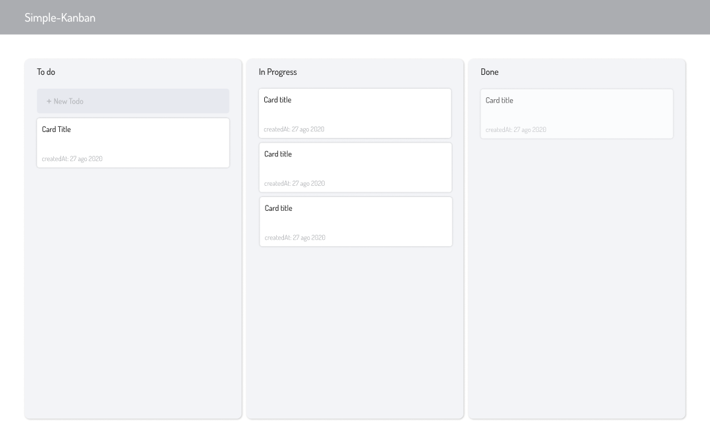

# Simple-Kanban

**Description:**
> In this project I'm practice, first of all, my english 😁 and second of all, the technologies. Then, the technologies that I'm using are firebase like database and html/css/js to frontend. This project is a agile methodology framework

## Screenshot

Desktop: 1440x900

## What I will use:
- Methodology BEM
- Firestore
- HTML/CSS/JS